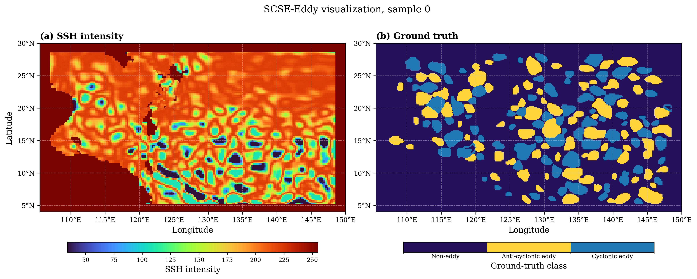

# EddyNetModel

本仓库用于海洋涡旋语义分割实验，主要面向 EddyNet、SCSE-Eddy、DUNet-like baseline，以及后续 NeurRL / 神经符号规则验证方法。

## 项目目标

本项目的核心目标是将深度学习涡旋识别模型与 NeurRL / 神经符号规则验证方法结合，提升海洋涡旋识别性能。

主要流程包括：

1. 复现并比较不同深度学习涡旋识别模型。
2. 在 EddyNet 和 SCSE-Eddy 数据集上训练统一口径的 baseline。
3. 导出预测 mask 和 probability map。
4. 提取涡旋候选实例特征。
5. 使用 NeurRL / NeSy verifier 对深度模型预测结果进行规则验证和修正。
6. 比较修正前后的 pixel-level 和 object-level 性能。

## 数据下载

本仓库不直接上传大型数据文件。

完整数据已上传至 Hugging Face Dataset：

https://huggingface.co/datasets/Bingzheng27/ocean-eddy-datasets

数据包括 EddyNet / Southern Atlantic 数据集、SCSE-Eddy / South China Sea 数据集、SCSE-Eddy prepared npz 文件和 SHA256 校验文件。

如果 Hugging Face 数据集为 private，需要先登录 Hugging Face，并确保账号具有访问权限。

## 本地数据目录

建议将数据放在本仓库的 data 目录下：

data/
  EddyNet/
    Data/
      trainAVISO-SSH_2000-2010.npy
      trainSegmentation_2000-2010.npy
      testAVISO-SSH_2011.npy
      testSegmentation_2011.npy

  SCSE_clean/
    prepared/
      scse_eddy_fullmap_filtered.npz
    source_npy/
      filtered_SSH_train_data.npy
      filtered_SSH_vali_data.npy
      SSH_train_data.npy
      SSH_vali_data.npy
      train_groundtruth_Segmentation.npy
      vali_groundtruth_Segmentation.npy

## 仓库结构

code/
  训练、评估、预测导出和规则验证脚本。

models/
  模型结构，例如 U-Net、EddyNet-like、PSPNet、DeepLabV3+、DUNet-like。

scripts/
  一键运行脚本。

runs/
  实验输出目录，不上传 GitHub。

logs/
  日志目录，不上传 GitHub。

docs/
  实验记录与方法说明。

assets/
  图片和可视化结果。

data/
  本地数据目录，不上传 GitHub。

## Dataset Visualization

下面的图片展示了一个 SCSE-Eddy 初始数据样本的可视化结果，用于检查 SSH 输入和对应标签的基本形态。该图不是 DUNet 或其他模型的预测结果图。

所有 baseline 模型训练完成后，将继续统一补充多模型 qualitative comparison。

## Baseline Results

所有 baseline 均使用统一的 SCSE-Eddy 数据划分、统一训练配置和统一评价流程。训练数据来自 `data/SCSE_clean/source_npy/`，验证集指标均基于同一套 pixel-level segmentation metrics 计算。

当前最佳模型为 DUNet，`mean_dice = 0.9230`，`mean_iou = 0.8583`，`global_acc = 0.9448`。

| rank | model | epoch | non_eddy_dice | anti_dice | cycl_dice | mean_dice | non_eddy_iou | anti_iou | cycl_iou | mean_iou | global_acc |
| --- | --- | --- | --- | --- | --- | --- | --- | --- | --- | --- | --- |
| 1 | DUNet | 66 | 0.9618 | 0.8977 | 0.9097 | 0.9230 | 0.9263 | 0.8143 | 0.8344 | 0.8583 | 0.9448 |
| 2 | AutoDetectionAttention | 79 | 0.9601 | 0.8948 | 0.9041 | 0.9197 | 0.9232 | 0.8096 | 0.8251 | 0.8526 | 0.9424 |
| 3 | MUNet | 74 | 0.9600 | 0.8929 | 0.9035 | 0.9188 | 0.9231 | 0.8065 | 0.8239 | 0.8512 | 0.9421 |
| 4 | DCNN | 74 | 0.9576 | 0.8888 | 0.9003 | 0.9156 | 0.9187 | 0.7998 | 0.8187 | 0.8457 | 0.9390 |
| 5 | EddyNet | 67 | 0.9522 | 0.8779 | 0.8926 | 0.9076 | 0.9087 | 0.7824 | 0.8060 | 0.8324 | 0.9319 |
| 6 | PSPNet | 80 | 0.9534 | 0.8734 | 0.8870 | 0.9046 | 0.9110 | 0.7752 | 0.7970 | 0.8277 | 0.9323 |
| 7 | DeepFramework | 75 | 0.9442 | 0.8448 | 0.8674 | 0.8855 | 0.8943 | 0.7313 | 0.7659 | 0.7972 | 0.9188 |

## Metric Visualization

Metric comparison figures are generated under `Figures/03_metric_comparison/`. These figures are intended for paper/report use and will be further refined together with qualitative comparison figures.

DUNet achieves the best reproduced mean Dice and mean IoU. The reproduced results are slightly lower than the paper-reported MIOU but preserve a comparable performance trend, supporting the use of DUNet as the main baseline for subsequent NeurRL experiments.

## Notes on Reproduction

这些结果是 unified re-implementation，不是 exact paper reproduction。所有模型被迁移到当前仓库的统一数据读取、训练损失、优化设置和评价脚本下，以保证横向比较口径一致。

与 DUNet 论文中 South China Sea 的结果总体可比，但当前统一复现的绝对 MIOU 略低。

后续 NeurRL / neurosymbolic rule verification 会基于这些统一 baseline 继续做性能提升实验。

## 标签定义

两个数据集均采用三分类语义分割标签：

0 = non-eddy，非涡旋背景
1 = anti-cyclonic eddy，反气旋涡
2 = cyclonic eddy，气旋涡

## 后续 NeurRL / NeSy 方向

在深度模型预测结果基础上，提取涡旋候选实例，并构建规则特征，例如面积、形状、紧致度、置信度、边界截断和时序连续性。

然后使用 NeurRL / NeSy verifier 判断候选涡旋是否可靠，并对深度模型预测结果进行修正。

## 数据链接

Hugging Face Dataset:

https://huggingface.co/datasets/Bingzheng27/ocean-eddy-datasets
